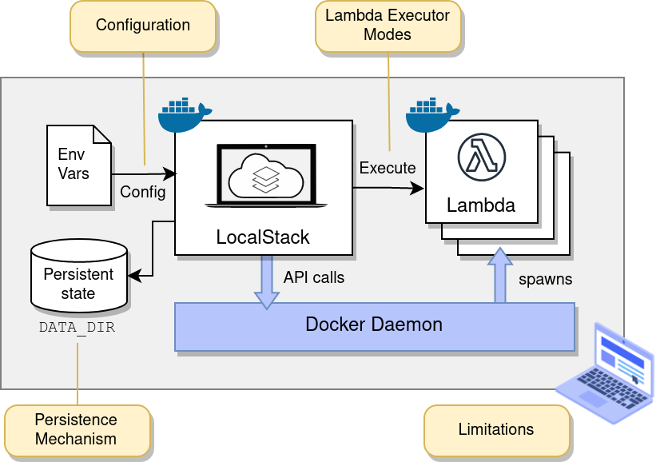

### SNS, SQS를 이용한 이벤트 기반 아키텍처 로컬 환경 개발시 발생하는 이슈
- 개발환경, 스테이징환경, 운영환경별로 또는 다른 환경별로 AWS SNS, SQS를 생성하여 개발을 진행중이다.
- 각각의 환경별로 SNS, SQS를 생성하였기 때문에 개발환경에서 메세지를 Publish를 하고, 다른 환경에서 해당 메시지를 Consume할 일은 없다. 하지만 로컬환경에서는 한가지 문제가 있다.
- 많은 개발자들이 각 로컬환경에서 SNS, SQS를 이용한 이벤트들을 생성하고 소비할 것이고 이를 대비하기 위하여 개발자 별로 SNS, SQS를 생성할 수 없다. 만약 생성하였다고 하더라도 운영, 관리 측면에서 관리가 되지 않될 가능성이 높다.
- 이를 해결하기 위하여 AWS환경을 각 로컬 PC에 사용할 수 있는 방법을 찾다가 LocalStack이라는 것을 찾게되었고, 설치형 뿐만 아니라 Docker를 이용하여 셋팅이 가능하기 때문에 다른 개발자와 쉽게 공유가 가능한 장점이 존재한다.

### LocalStack
- [LocalStack](https://www.localstack.cloud/) 메인 페이지를 들어가면 해당 프로그램이 어떤것을 해결하기 위하여 나오게 되었는지 자세하게 설명하고 있다.
    > ***Develop and test your AWS applications locally*** to reduce development time and increase product velocity. Reduce unnecessary AWS spend and ***remove the complexity and risk of maintaining AWS dev accounts***.
- 간단하게 설명하자면 각 로컬 PC별로 AWS 애플리케이션을 개발 및 테스트가 가능하고, AWS 개발 계정에 대한 복잡함을 줄인다고 되어있다. 
- 설치형을 이용하여 간단하게 이용할 수도 있지만, 해당 글을 작성하는 목적은 다른 개발자와 공유하면서 활용하는 것이기 때문에 Docker를 이용할 예정이다.

### Docker를 이용한 LocalStack 셋팅하기

- [docker-compose.yml](./docker/docker-compose.yml)
    ```yaml
    services:
    localstck:
        container_name: localstack
        image: localstack/localstack
        ports:
        - 4566:4566           # LocalStack Gateway
        - 4510-4559:4510-4559 # external services port range
        environment:
        # LocalStack configuration: https://docs.localstack.cloud/references/configuration/
        - SERVICES=sns,sqs
        - AWS_ACCESS_KEY_ID=test
        - AWS_SECRET_ACCESS_KEY=test
        - ENABLE_CONFIG_UPDATES=1
        - DEBUG=1
        volumes:
        - "./init-aws.sh:/etc/localstack/init/ready.d/init-aws.sh"  # ready hook
        - "./localstack:/var/lib/localstack"
        - "/var/run/docker.sock:/var/run/docker.sock"
    ```

- [init-aws.sh](./docker/init-aws.sh)
    ```sh
    #!/bin/bash

    awslocal sqs create-queue --queue-name my-queue

    awslocal sns create-topic --name my-topic

    awslocal sns subscribe \
        --topic-arn "arn:aws:sns:us-east-1:000000000000:my-topic" \
        --protocol sqs \
        --notification-endpoint "arn:aws:sqs:us-east-1:000000000000:my-queue"
    ```

- [LocalStack > Starting LocalStack with Docker-Compose](https://docs.localstack.cloud/getting-started/installation/#docker-compose) 공식문서를 통해서 Docker Compose를 이용하여 LocalStack 환경 구축 및 추가적인 셋팅을 해두었다.  

#### ports


- LocalStack의 아키텍처를 간단하게 살펴보면 LocalStack의 Gateway를 통해서 필요한 AWS 서비스 엔드포인트들을 호출하게 되면, 클라이언트가 요청한 해당 AWS 서비스들이 응답해 주는 구조를 가지고 있다.
  - `4566:4566`
- Gateway를 통해서 LocalStack의 구성 정보나, 상태 체크등 다양한 정보를 확인할 수 있는 엔드포인트를 제공한다. 특히 구성정보가 제대로 셋팅이 되었는지 확인하기 좋다.
  - [LocalStack > Internal Endpoints](https://docs.localstack.cloud/references/internal-endpoints/)
- 만약 Gateway를 통한 호출이 아닌 AWS 서비스에 직접 접근하여 호출하고 싶다면, AWS 관련 서비스 포트를 열어 두어야한다.
  - `4510-4559:4510-4559`
- Gateway와 AWS 서비스 관련 포트에 대한 내용에 관하여 좀 더 자세한 자료가 필요하다면 아래 공식문서를 참고하자.
  > [LocalStack > External Service Port Range](https://docs.localstack.cloud/references/external-ports/)

#### environment
- environment에 내용을 작성하게 되면 LocalStack의 구성정보를 설정할 수 있다.
- 기본적으로 어떤 AWS 서비스를 설정할지, 애플리케이션에서 사용할 키의 정보 또는 리전을 셋팅할 수 있다. 구성 정보와 관련하여 좀 더 자세한 자료가 필요하다면 아래 공식문서를 참고하자.
    > [LocalStack > configuration](https://docs.localstack.cloud/references/configuration/)
- 내가 셋팅한 구성정보를 확인하고자 한다면 `http://localhost:4566/_localstack/config` 엔드포인트를 통해서 확인이 가능하다.


#### volumes
- volumes 내용을 작성하여 LocalStack에 개발자가 필요한 AWS 서비스들에 대하여 초기화 작업을 진행할 수 있다.
- LocalStack을 이용하면서 로컬 PC 환경에서도 AWS 서비스를 활용는 것 뿐만 아니라, ***내가 셋팅해놓은 AWS 서비스들을 다른 개발자와 공유하고 변경 내용 또한 쉽게 셋팅할 수 있다.***
- `/etc/localstack/init/ready.d/init-aws.sh` 파일에 내가 초기화하고자하는 서비스를 LocalStack CLI를 이용하여 작성하면 된다.
  - LocalStack CLI는 AWS CLI와 굉장히 유사하다.
  - 조금 더 자세한 자료가 필요하다면, [LocalStack > Initialization Hooks](https://docs.localstack.cloud/references/init-hooks/)을 참고해보자.
- 현재 내가 필요한 것은 SNS, SQS 이기 때문에 해당 AWS 서비스들만 초기화를 해두었다.


### Spring Application에 LocalStack 셋팅하기


### localstack 초기화

> https://docs.awspring.io/spring-cloud-aws/docs/3.1.1/reference/html/index.html
> https://docs.localstack.cloud/user-guide/aws/sns/
> https://docs.localstack.cloud/user-guide/aws/sqs/
> https://docs.localstack.cloud/references/init-hooks/
> https://docs.localstack.cloud/references/internal-endpoints/


> https://tech.inflab.com/202202-integration-test-with-localstack/

> https://techblog.woowahan.com/2638/