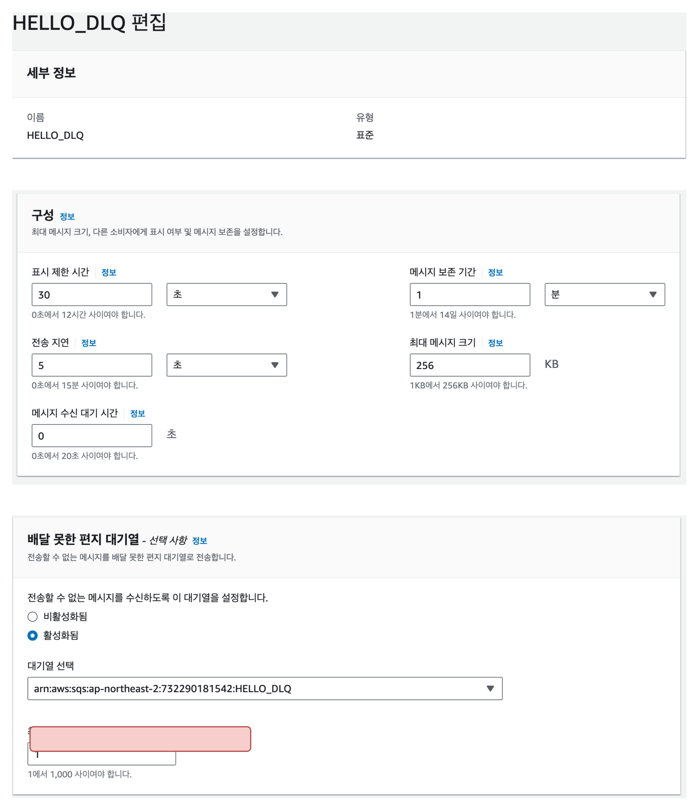
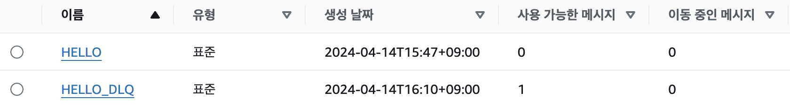
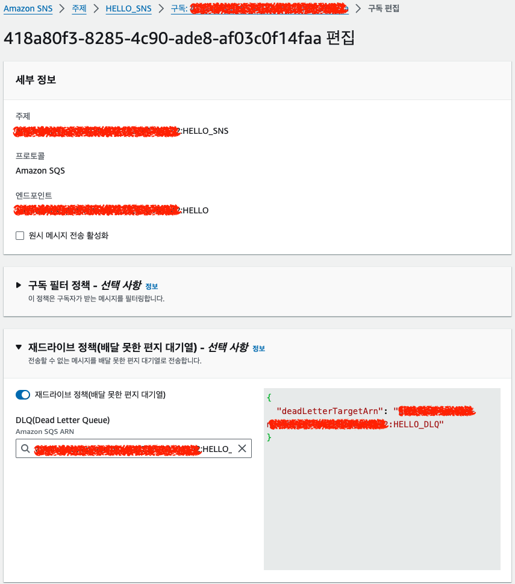
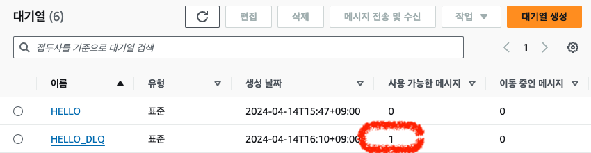

### SNS_SQS

- 스프링 애플리케이션과 AWS 서비스인 SNS, SQS를 이용하여 이벤트 기반 아키텍처를 구현하고 있다.


#### 스프링 애플리케이션, SNS, SQS를 이용하여 이벤트 기반 아키텍처 구조

- 위 그림을 통해서 확인할 수 있듯이 유저의 요청에 따라서 이벤트를 발행하고 수신하게 된다.
  1. 유저가 유저 인터페이스(API)를 통해서 애플리케이션에게 요청을 하면 해당 애플리케이션은 기능을 수행한다.
  2. 애플리케이션이 기능을 수행하는 도중 SNS에게 이벤트를 발행한다.
  3. SNS는 구독중인 SQS에게 메시지를 전송한다.
  4. SQS에 존재하는 메시지를 애플리케이션이 소비하여 해당 이벤트에 대한 기능들을 수행한다.
- 해당 기능들이 우리가 원하는 대로 작동만한다면 좋겠지만, 네트워크 또는 비지니스 로직의 문제로 인하여 메시지가 제대로 송수신이 안되는 경우가 발생할 수 있다.
  - 이벤트 기반 아키텍처를 사용하게되면 해당 기능의 흐름을 정확히 파악하기 어려운 문제가 발생한다.
  - 때문에 문제가 발생하였을 때 실패한 메시지를 제대로 보관하고 있지 않다거나, 해당 문제가 발생하였을 때 자동화를 하지 않거나, 모니터링을 수행하지 않게되면 개발자가 문제를 해결할 수 없거나 유저 입장에서도 서비스를 제대로 사용할 수 없다.
- 때문에 단순히 기능을 만드는 것 뿐만 아니라 운영시 발생할 수 있는 이슈들에 대하여 대비를 할 수 있어야 한다.


#### 스프링 애플리케이션, SNS, SQS를 이용하여 이벤트 기반 아키텍처 운영시 발생할 수 있는 문제

- 스프링 애플리케이션, SNS, SQS를 통해서 이벤트 기반 아키텍처를 구현할 때 발생할 수 있는 주요
  - 애플리케이션이 SQS의 메시지를 소비하면서 발생하는 문제
  - SQS가 SNS의 메시지를 소비하면서 발생할 수 있는 문제
  - 애플리케이션에서 SNS를 전송시 발생할 수 있는 문제
- 애플리케이션-SNS-SQS-애플리케이션으 흐름이 이어지는 상황에서 우리가 사용자에게 메시지를 어떻게 자동으로 다시 재전송할 수 있을지에 대하여 고민을 해봐야 한다.

#### 1. SQS -> 애플리케이션 메시지 전송이 실패하면서 발생할 수 있는 문제
- SQS를 통해서 애플리케이션이 해당 메시지를 소비하는 과정에 문제가 발생할 수 있다.
- 이를 해결하기 위하여 두 가지 단계를 통해서 문제를 해결한다.
  - 메시지 소비가 실패할 경우 해당 메시지를 DLQ로 이동
  - DLQ의 메시지는 수동으로 리드라이브 하는 것이 아닌 자동으로 리드라이브할 수 있도록 설정
- SNS에서 DLQ로 이동을 하는 상황을 먼저 만들어서 해당 DLQ를 자동으로 리드라이브 할 수 있도록 제작예정
- SNS에서 DLQ로 메시지가 이동할 때 중요한 것은 ***Visibility Timeout (표시 제한 시간), DLQ 최대 수신 수 ***이다.

- SQS는 대기열에 존재하는 메시지를 정상적으로 수신하지 못한 경우 해당 메시지를 DLQ로 이동할 수 있다.
  - 메시지가 DLQ로 이동하게 되면서 해당 메시지를 분석하여 애플리케이션의 문제를 파악할 수 있으며, 해당 문제가 해결된 이후에 다시 DLQ에 존재하는 메시지를 SQS로 옮겨 재전송 할 수 있다.
- SQS가 DLQ로 이동하는 원리를 알기 위해서는 ***표시 제한 시간, DLQ 최대 수신 수***에 대해서 알고 있으면 좋다.
  - 해당 내용을 자세히 알고 싶으면 [SQS](https://github.com/yhnoh/aws/tree/master/sqs) 자료를 참고하자.

1. SQS 메시지 수신 실패시 DLQ로 메시지 이동 

- `HELLO, HELLO_DLQ` 두개의 큐를 생성한 이후, HELLO 큐에 HELLO_DLQ를 셋팅해 두었다.
- 표시제한시간은 30초 이기 때문에 메시지가 정상적으로 처리되지 않을 경우 30초 뒤에 재 수신을 한다.
- DLQ 최대 수신수는 1이기 때문에 1번 수신을 실패하게 되면 DLQ로 메시지가 이동하게 된다.

```java
@RestController
@RequiredArgsConstructor
public class HelloController {

    private final SqsTemplate sqsTemplate;
    private static final String QUEUE_NAME = "HELLO";

    @GetMapping("/hello-world")
    public String helloWorld() {
        SendResult<String> result = sqsTemplate.send(to -> to.queue(QUEUE_NAME).payload("hello world"));
        return result.message().getPayload();
    }

    @SqsListener(QUEUE_NAME)
    public void receiveMessage(@Headers Map<String, String> headers, @Payload String payload) {
        System.out.println("메시지 수신 성공!!!");
        throw new IllegalArgumentException("비지니스 로직 문제 발생");
    }

}
```
- 해당 소스를 확인하게 되면 `/hello-wrold`엔드포인트를 호출하게 되면 `HELLO` 큐에 메시지를 전송하게 된다.
- 이후 `HELLO` 큐에 담긴 메시지를 소비하는데 이때 메시지를 정상적으로 수신하지 못하도록 Exception을 발생시킨다.
- 해당 엔드포인트를 호출한 이후에 DLQ로 메시지가 이동하는지 한번 확인해보자.
<br/>



- DLQ에 정상적으로 메시지가 이동된것을 확인할 수 있으며, 해당 메시지를 분석하여 애플리케이션에 어떤 문제가 있는지 진단할 수 있게 되었다.
- 애플리케이션을 수정한 이후 배포를 한 뒤, 수동으로 DLQ에 존재하는 메시지를 리드라이브하면 정상적으로 메시지를 소비할 수 있다.
- 하지만 수동으로 콘솔 또는 SQS API를 통해서 메시지를 리드라이브를 한다는 것은 좋은 방법이 아니다.
  > 누군가가 계속해서 신경써야할 상황은 왠만하면 만들지 않는 것이 좋다.
- 때문에 DLQ 대기열에 존재하는 메시지를 자동으로 리드라이브하여 이벤트를 정상화 할 수 있어야한다. 


2. DLQ로 이동한 메시지를 자동으로 리드라이브하기
- 자동으로 리드라이브를 하기위해서는 두가지 조건이 필요하다.
  - Amazon SQS에서 리드라이브관련 API를 제공하는지?
  - 배치 또는 특정 트리거를 통해서 SQS 리드라이브 API를 호출할 수 있는지?
- Amazon SQS에서는 리드라이브 관련 API를 제공하고 있으며, 해당 API를 이용하여 배치 또는 특정 트리거를 이용하여 자동으로 리드라이브를 하면된다.
  - Amazon SQS에서 제공하는 DLQ관련 API 
    - StartMessageMoveTask
      - DLQ 대기열에 존재하는 메시지를 기존 대기열로 이동할 수 있는 API
      - DLQ 하나만 요청이 가능
    - ListMessageMoveTasks
      - 가장 최근의 DLQ 대기열로 메시지가 이동된 내역을 확인할 수 있는 API (최대 10개) 
    > [SQS > DLQ 리드라이브 API](https://docs.aws.amazon.com/ko_kr/AWSSimpleQueueService/latest/SQSDeveloperGuide/sqs-configure-dead-letter-queue-redrive.html#sqs-configure-dead-letter-queue-redrive-API)

- Amazon SQS에서 제공하는 DLQ관련 API를 기반으로 자바 코드 작업
```java
@Service
@RequiredArgsConstructor
public class DlqService {

    private final SqsAsyncClient sqsAsyncClient;

    public StartMessageMoveTaskResponse startMessageMoveTaskResponse(String queueName) throws ExecutionException, InterruptedException {
        String arn = getArn(queueName);
        return sqsAsyncClient.startMessageMoveTask(to -> to.sourceArn(arn)).get();
    }

    public ListMessageMoveTasksResponse listMessageMoveTasksResponse(String queueName) throws ExecutionException, InterruptedException {
        String arn = getArn(queueName);
        ListMessageMoveTasksResponse listMessageMoveTasksResponse = sqsAsyncClient.listMessageMoveTasks(to -> to.sourceArn(arn)).get();
        return listMessageMoveTasksResponse;
    }


    private String getArn(String queueName) throws InterruptedException, ExecutionException {

        GetQueueAttributesResponse getQueueAttributesResponse = sqsAsyncClient.getQueueUrl(to -> to.queueName(queueName))
                .thenCompose(getQueueUrlResponse -> sqsAsyncClient.getQueueAttributes(to -> to.queueUrl(getQueueUrlResponse.queueUrl())
                        .attributeNames(QueueAttributeName.QUEUE_ARN))).get();
        return getQueueAttributesResponse.attributes().get(QueueAttributeName.QUEUE_ARN);
    }

}
```

### 2. SNS -> SQS 메시지 전송

- SNS와 SQS를 이용한 이벤트 기반 아키텍처를 구현할 때, SNS는 이벤트의 주체가되며 SQS는 이벤트를 전달받아 실제 기능을 수행하게 된다.
- 때문에 거의 대부분의 경우 SNS에 SQS를 연결시켜 사용하게 되며, SNS에서 SQS롤 메시지를 전달하는 과정에서 메시지 전송이 실패할 수 있는 상황이 발생할 수 있다.

#### 2.1. SNS -> SQS 메시지 전송이 실패하는 경우
- SQS에서 SNS로 메시지를 전달할 때, 클라이언트 또는 서버측 오류로 인하여 메시지 전송이 실패할 수 있다.
- 클라이언트 측 오류
  - 구독자의 엔드포인트를 삭제하는 경우
  - 정책을 변경하여 SNS에 메시지를 전송하지 못하는 경우
- 서버 측 오류
  - 시스템 사용 불가로 또는 유효한 요청이 아닐 때 예외를 발생시키는 경우
> [AWS > 메시지 전송이 실패하는 이유](https://docs.aws.amazon.com/ko_kr/sns/latest/dg/sns-dead-letter-queues.html#why-do-message-deliveries-fail)

#### 2.2. SNS -> SQS 메시지 전송 실패시 메시지를 재전송할 수 있는 방법

1. 서버 측 오류 발생시에는 SNS는 재전송 정책에 따라서 메시지를 재전송
2. SNS는 재전송 정책에 따라서 메시지를 재전송하였지만 계속 실패하여 해당 메시지를 DLQ에 메시지 전달
3. 클라이언트 측 오류 발생시 DLQ에 메시지 전달

- 기본적으로 SNS 재전송 정책을 통해서 메시지를 전송하겠지만 해당 시간동안 재전송이 안이루어진 경우, 또는 클라이언트 측 오류로 인하여 메시지가 전송이 안된 경우 DLQ에 메시지를 이동시키지 않으면 해당 이벤트의 메시지를 손실하게된다.
- 때문에 메시지를 복원시키기 위하여 SNS 구독자별로 DLQ를 연결하고, 해당 DLQ 리드라이브를 통해서 해당 메시지를 복원할 수 있도록 조치를 취해야한다.
  - 이벤트에 대한 메시지가 정상적으로 처리되지 않았는데 메시지를 손실할 경우 재 전송해줄 방법이 없다. 
- SNS 재전송 정책은 개발자가 정의한 시간 또는 횟수만큼 재전송이 이루어지며, DLQ 대기열에 존재하는 메시지는 리드라이브 API를 통해서 자동으로 전송할 수 있다.
- SNS는 구독자 별로 DLQ에 메시지를 보존하기 때문에 구독자를 편집하는 화면에서 DLQ를 연결할 수 있다.


- 위 이미지를 보면, HELLO_SNS를 HELLO_SQS가 구독하고 있으며, 만약 SNS에서 SQS 전송이 실패하게 될경우, HELLO_DLQ로 메시지가 이동되는 것을 확인할 수 있다.

#### 2.3. SNS -> SQS 메시지 전송을 실패시켜 DLQ에 메시지가 이동되는지 확인
- 메시지 전송이 실패하는 경우에서 클라이언트측 오류에서 `정책을 변경하여 SNS에 메시지를 전송하지 못하는 경우`를 이용하여 DLQ에 메시지가 이동하는지 한번 확인해보자.
- SQS가 SNS의 메시지를 전달받으로면 아래와 같은 엑세스 정책이 필요하다.
  ```json
  {
    "Version": "2012-10-17",
    "Id": "__default_policy_ID",
    "Statement": [
      {
        "Sid": "__sns_statement",
        "Effect": "Allow",
        "Principal": {
          "Service": "sns.amazonaws.com"
        },
        "Action": "SQS:SendMessage",
        "Resource": "[SQS ARN]",
        "Condition": {
          "ArnLike": {
            "aws:SourceArn": "[SNS ARN]"
          }
        }
      }
    ]
  }
  ```
  > [AWS > Amazon SQS 대기열에서 Amazon SNS 주제 구독](https://docs.aws.amazon.com/ko_kr/sns/latest/dg/subscribe-sqs-queue-to-sns-topic.html#SendMessageToSQS.iam.permissions.resource)

- 만약 해당 정책을 없애고 메시지를 전송할 경우 클라이언트 측 오류가 발생하며, 해당 메시지가 DLQ로 이동하게 된다.
```java
@RestController
@RequiredArgsConstructor
public class SNSController {

    private final SnsTemplate snsTemplate;

    @GetMapping("/sns/send")
    public void sendSNS() {

        snsTemplate.convertAndSend("HELLO_SNS", "hello");
    }
}
```
- `/sns/send` 엔드포인트를 호출하게 될 경우 SNS에 메시지를 전송하게 되며, 해당 SNS를 구독하는 SQS가 메시지를 전달받게 된다.
- 하지만 SQS에 엑세스 정책을 설정해두지 않았기 때문에 해당 메시지는 DLQ로 이동되는 것을 확인할 수 있다.


- DLQ에 전송된 메시지를 분석하여 애플리케이션에 어떤 문제가 있는지 진단하고 해당 문제를 해결하고 난 뒤에 리드라이브를 할 수 있게 되었다.
- 만약 리드라이브를 수동이 아닌 자동으로 하고자한다면 스케쥴러 및 배치를 이용하여 SQS 리드라이브 API를 호출하면된다.

> [AWS > Amazon SQS 대기열에서 Amazon SNS 주제 구독](https://docs.aws.amazon.com/ko_kr/sns/latest/dg/subscribe-sqs-queue-to-sns-topic.html#SendMessageToSQS.iam.permissions.resource)
> [AWS > Amazon SNS 배달 못한 편지 대기열(DLQ)](https://docs.aws.amazon.com/ko_kr/sns/latest/dg/sns-dead-letter-queues.html)


### 3. 애플리케이션 -> SNS 메시지 전송

- 애플리케이션에서 이벤트를 전달하기 위하는 주체로써 SNS를 이용한다.
- 하지만 애플리케이션에서 SNS로 메시지를 전송하는 과정에서 메시지 전송이 실패할 수 있는 상황이 발생할 수 있다.

#### 3.1. 애플리케이션 -> SNS -> SQS 이벤트 기반 아키텍처의 기본 구조

1. 클라이언트가 서버에게 요청을 한 이후, 서버는 해당 요청에 대한 로직을 수행한다.
2. 트랜잭션 커밋이 완료된 이후 클라이언트에게 응답하고, 해당 로직과 ***불필요한 관심사들은 비동기를 이용하여 이벤트로 전달하여 후처리***한다.
3. 이벤트를 전달받은 SNS는 구독자인 SQS에 이벤트를 전달한다.
4. SQS를 소비하는 애플리케이션들은 해당 이벤트를 전달받아 로직을 수행하게 된다.

- 위는 애플리케이션 -> SNS -> SQS를 이용한 이벤트 기반 아키텍처의 과정이다.
- 해당 과정이 문제없이 동작하면 좋겠지만 정상적으로 동작하지 않을 시, 올바르지 않은 데이터가 저장되어 있을 수 있거나 고객이 정상적인 서비스 이용하지 못할 수 있다.
  - 불필요한 관심사들을 비동기를 이용하여 이벤트로 전달하여 후처리한다는 것이지 이벤트 자체가 중요하지 않다는 의미는 아니다.
- 애플리케이션 -> SNS로 이벤트를 전달하는 행위는 HTTP통신을 사용하기 때문에 네트워크 오류나, 서버측 클라이언트측 오류가 발생할 수 잇다.
- 때문에 실패한 이벤트의 재발행을 위하여, 또는 성공한 이벤트라도 정상 동작하지 않을 경우 특정 시점의 이벤트를 재발행할 수 있어야 한다. 이러한 문제를 해결하기 위해서는 이벤트를 어딘가에 보관하고 이를 재발행시킬 수 있어야한다.
  - SNS -> SQS -> 애플리케이션의 경우에는 실패한 이벤트에 대하여 어떻게 처리할지를 지원하지만, 애플리케이션 -> SNS으로 전송하는 과정은 지원하지 않기 때문에 해당 문제를 해결하기 위해서

#### 3.2. 애플리케이션 -> SNS 이벤트 재발행을 위한 메시지 보관


- 클라이언트가 요청을 진행한 이후

#### 3.2. 애플리케이션 -> SNS 메시지 전송 실패시 메시지를 재전송할 수 있는 방법
1. SNS에게 메시지 전송 전, 해당 메시지를 저장소에 보관
   - SNS에게 메시지를 전송하기 전이기 때문에 저장소에 저장된 메시지 전송 상태는 false
2. 메시지 전송이후 해당 메시지가 정상적으로 처리되었다는 것을 알리기 위하여 메시지 전송 상태 변경
   - 저장소에 저장된 메시지 전송 상태를 true로 변경
3. 메시지 전송 실패시, 배치를 이용하여 해당 재전송
   - 메시지 전송 상태가 false인 데이터를 가져와 메시지를 재전송

### 3.3. 메시지 재발행을 위하여 이벤트 정의 및 스키마 정의

```java
class EventRecordJpaEntity {

    @Id
    @GeneratedValue(strategy = GenerationType.IDENTITY)
    @Column(name = "id")
    private long id;

    @Builder.Default
    @Column(name = "published")
    private boolean published = false;

    @Column(name = "published_at")
    private LocalDateTime publishedAt;

    @Column(name = "event_channel")
    private String eventName;

    @Setter(AccessLevel.PACKAGE)
    @Column(name = "event_payload")
    private String eventPayload;

    @Builder.Default
    @Column(name = "created_at")
    private LocalDateTime createdAt = LocalDateTime.now();
    
    public void published() {
        published = true;
    }
}
```
- 이벤트를 발행한 메시지를 보관하는 엔티티의 정의이다.
- 해당 엔티티는 메시지가 발행되는 시점에 데이터를 저장하고, 이벤트가 정상적으로 발행되면 `published()`메서드를 이용하여 메시지 발행 상태를 정상처리한다.
- `eventName`: 이벤트 이름 (SNS 토픽 이름)
- `eventPayload`: 이벤트로 발행되는 페이로드


### 해당 작업을 진행하는 이유
- 애플리케이션에서 SNS로 메시지를 전송하는 행위 또한 HTTP통신을 하기 때문에 네트워크 오류로 인하여 메시지 전송 과정에서 문제발생 가능성 존재
- 이벤트를 전달받은 애플리케이션의 잘못된 로직으로 인하여 오류 없이 정상 처리 되었을 경우, 해당 로직 수정 이후 이벤트를 재발행할 수 있어야 한다.

> https://techblog.woowahan.com/7835/

