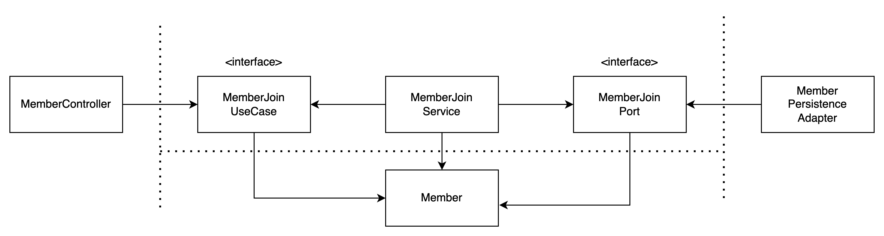
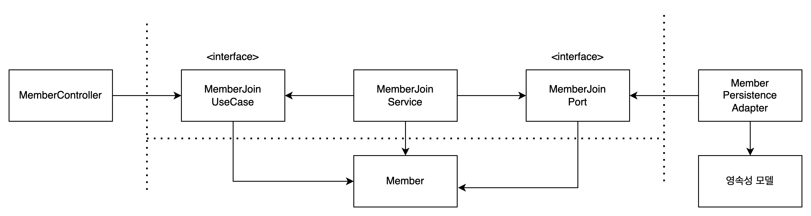
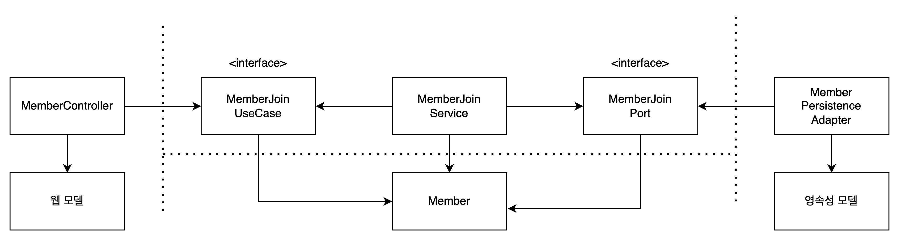
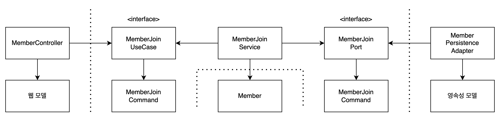

### 1. 계층형 아키텍처 (Layerd Architecture)

---

#### 1.1 계층형 아키텍처 구조


- 우리가 흔히 개발하는 방식들은 계층형 아키텍처로 위와 같은 흐름을 가지고 있다.
  
1. Database Layer, Persistence Layer
    - 저장소에서 데이터를 불러와 dao(jpa entity)에 매핑한다.
      - 저장소는 Database라고 이해하지 말고 `데이터를 저장하는 곳`이라고 이해하면 좋다.
      - 때문에 저장소는 Database, File, 외부 API 등이 될 수 있다.
    - 저장소와 연결되어 저장소의 데이터를 처리하는 layer다.
      - 주로 CRUD 작업을 실제로 처리하는 정보들을 가지고있다.
2. Domain or Business or Service Layer
    - dao를 가지고와 실제 비지니스 로직을 수행하는 역할을 하며 애플리케이션 내부에서 수행해야하는 거의 모든 작업들을 진행한다.
      - 애플리케이션 내부 사용자가 필요한 데이터를 리턴 (DTO)
      - 저장소에 데이터를 삽입, 수정, 삭제를 진행하기 위해서 필요한 행위를 진행
      - 입력 모델에 대한 유효성 검사
      - 비지니스 로직에 대한 유효성 검사  
      - 등등..
3. Presentation Layer
    - 애플리케이션 외부의 사용자와의 상호작용을 처리하는 계층이다.
      - 외부 사용자가 요청 수 있는 방법을 제공
        - HTTP, TCP, CLI 
      - 외부 사용자에게 요청을 어떻게 받을지 어떻게 응답을 할지 결정
        - JSON, HTML, XML 
      - 외부 사용자 요청에 대한 입력 모델을 검사


#### 1.2. 계층형 아키텍쳐 패키지 구조
- 모든 것을 일반화 하기는 힘들 겠지만 계층형 아키텍처의 패키지 구조는 기능별 또는 화면별로 패키지를 먼저 구분하고 아래와 같은 구조를 가질 것이다.
```text
└── member
    ├── controller
    │   └── MemberController.java
    ├── dto
    │   └── MemberDTO.java
    ├── entity
    │   └── MemberJpaEntity.java
    ├── repository
    │   └── MemberJpaRepository.java
    └── service
        ├── MemberService.java
        └── MemberServiceImpl.java
```
- controller 패키지는 Presentation Layer로써 사용자의 요청과 응답을 처리한다.
- service 패키지는 Domain or Business or Service Layer 로써 member와 관련된 모든 비지니스 로직을 담당한다.
  - service는 repository와 관련된 의존성을 가지고 있으며 dao 가져와서 비지니스 로직을 처리한다.
  - service와 service, service와 controller는 dto를 통해서 데이터를 주고 받는다.
- repositroy는 저장소에 데이터를 불러와 dao에 매핑을 한다.

#### 1.3. 계층형 아키텍쳐에 대해 생각해보기

1. 계층형 아키텍쳐를 사용하면 관심사를 분리하여 각 계층별로 무엇을 해야할지가 명확하다.
2. 관련된 내용을 서로 모아놓기 때문에 응집도가 높고, 기본적으로 인터페이스를 두고 개발을 진행하기 때문에 결합도가 낮은 특징을 가지고 있다.
  - 때문에 한눈에 알아보기 쉽고 쉽게 변경가능하다.

#### 1.4. 계층형 아키텍쳐는 무엇이 문제일까?

> Domain or Business or Service Layer를 서비스 계층 또는 서비스라고 임의로 말하겠다. 

1. 프로젝트가 커지면서 서비스 계층의 역할이 많다보니 작업하는 서비스가 어떤 역할인지 알아보기가 힘들어진다.
   - 예를 들어 MemberSerivce라는 클래스 파일명을 보면 이 클래스가 무슨 역할을 하는지 알 수 있는가?
     - 정확히 해당 서비스가 어떤 역할을 하는지 파악하기 힘들기 때문에 MemberService로 들어가서 우라가 필요로하는 메서드들을 찾고 잇을 것이다.
   - ***새로운 개발보다 서비스 로직을 파악하는데 더욱 많은 시간을 쓰는일이 발생***한다.

2. 여러 개발자와 협업시 서비스내의 코드가 무분별하게 작성된다.
   - MemberService를 기준으로 예를 한번 들어보자.
     - 한 개발자가 Member에 대한 비지니스 로직을 처리한다고 생각해보면 해당 개발자는 자연스럽게 MemberService에 필요한 작업을 진행하고 있을 것이다.
     - 계속해서 다른 개발자가 Member에 대한 비지니스 로직을 만들기 위해서 MemberSerivce에서 작업을 진행한다.
     - Member에 대한 기능이 늘어날 수록 MemberService의 코드 양은 어마어마 하게 늘어나게 될 것이다.
   - ***서비스 클래스의 코드양이 많아지면 새로운 기능을 작성하거나 수정하는 입장에서 서비스의 내용을 파악하기 위해서 많은 시간을 쓰게 될 것***이다.
     - 특히 새로운 개발자가 들어오게 되면 이게뭐지? 라는 생각을 가지게 된다.
   - MemberSerivce의 코드양이 많아진다는 의미는 ***의존성도 끊임없이 늘어날 수 있다는 의미이므로 테스트 코드 작성이 쉽지 않을 것***이다.
   - MemberSerivce내에 ***기능이 많아지다 보니*** MemberService를 ***사용하는 입장에서도 어떤 메서드를 사용해야할지 파악하기 힘들 수 있다.***
   - Serive의 코드양이 계속 많아지는 상황을 해결하기 위해서 서비스를 회원별 기능으로 나누어 작업하는 진행하기도 한다.
     - 당장의 문제를 현실적으로 해결하기위한 좋은 방법이라고 생각한다.
   
3. 기껏 만들고 있는 서비스 인터페이스가 의미가 없어진다.
   - 서비스 인터페이스를 구현한 서비스 구현 클래스는 필수적으로 만들 수 밖에 없다.
   - 인터페이스를 만드는 이유는 실제 구현 클래스가 무슨일을 하는지 숨기고 싶거나 무엇을 표현하고자 할때 쓰인다.
   - MemberSerivce의 경우 MemberServiceImpl이외에 다른 클래스에서 사용되고 있지 않다.
     - 무슨일을 숨기기 위해서 사용되는 것도 아니라면 무엇을 표현하고자할 때 쓰여야하는데 MemberService라는 것을 보고 과연 다른 개발자들이 이게 무엇을 의미하는지 알 수 있을까?
   - 왜 만들어야 되는지에 대한 고민 없이 그냥 그렇게 만들어왔으니까 만드는 경우를 나는 많이 목격해왔다.

4. 서비스 계층에서 Data Access Object를 직접 접근하기 때문에 변경하기 힘든 코드가 된다.
  - Data Access Object 를 직접 다룬다는 말은 아래와 같은 코드를 의미한다.
    ```java
    @Service
    @RequiredArgsConstructor
    public class MemberServiceImpl implements MemberService {
        
        private final MemberJpaRepository memberJpaRepository;
        
        public void join(MemberDTO memberDTO){

            //DAO에 직접 접근하여 저장까지 진행
            Member member = new Member(memberDTO.getUsername());
            memberJpaRepository.save(member);
        }
    }
    ```
  - 요즘은 JPA를 많이 쓰고 있기 때문에 JPA를 기준으로 코드를 작성해 보았다.
  - 서비스 코드가 JPA의 기능을 직접 제어하고 있기 때문에 ***엔티티가 변경이 되었을 때 변경된 서비스 코드를 전부 봐야하는 경우가 발생***한다.
    - 소규모 프로젝트의 경우는 그래도 작업이 가능하지만 대규모 프로젝트의 경우에는 모든 서비스 코드를 확인해 가면서 변경해야하기 때문에 굉장히 어려운 작업이 된다.
    - 개발 히스토리를 잘 알고 있는 사람이 아니라면 ***해당 코드를 수정하기 힘들 것이며 수정하더라도 어떤 여파가 일어날 지 알수가 없다.***
  - 또한 ***JPA에는 여러 자동화 기능을 제공하며 서비스 코드내에서 자동화 기능을 제어***해야한다.
    - 대표적으로 지연 로딩이 있으며 N + 1 문제를 생각해볼 수 있다.
  - ***저장소의 변경이 전역적으로 퍼져있는 모든 서비스 코드를 수정해야하는 경우가 발생***할 수 있다.
    - 예를 들어 RDS JPA를 사용하다 갑자기 메세지 큐, 파일, RDS <-> NoSQL과 같은 저장소로 변경이 되었을 때 변경에 대한 대응이 참으로 난감할 것이다.
    - 요즘 핫한 MSA를 생각해보면 모놀리식 아키텍쳐에서 MSA 아키텍쳐를 변경하는 작업에서 일부 저장소들이 계속해서 때어져 나가고 통신하는 방식으로 변경이 될 것인데 이 또한 저장소의 변경이기 때문에 해당 내용에 해당하는 모든 서비스 코드를 수정해야한다.

5. 모든 계층이 서로 접근이 가능하며 막을 방법이 없다.
  - 대부분의 개발자들은 Controller <-> Service <-> Persistence <-> Repository 형식으로 작업을 진행할 것이다.
  - 하지만 대부분의 개발이 클래스를 전부 public으로 열어놓고 작업을 진행할 것이다.
    - 제가 경험한 곳의 대부분이 이렇게 작업을 진행했기 때문에 개인적인 생각이므로 아닐수도 있다. 
    ```java
    @RestController
    public class MemberController {
    }

    @Service
    public class MemberServiceImpl implements MemberService {

    }

    @Repository
    public interface MemberJpaRepository extends JpaRepository<Member, Long> {
    }

    ```
  - 모든 계층 클래스 들이 public으로 열려 있으니 실제로 controller에서 repository를 불러올 수 도 있다는 의미이다.
    - 막말로 service가 controller를 불러올 수 도 있다.
    - 물론 문제가 발생하지 않을 수는 있지만 애초에 권장하지 않는 방식이다.
  - 클래스와 인터페이스는 default와 publice으로 밖에 접근 제어를 하지 못함으로 인해서 일반적인 계층형 아키텍처의 패키지 구조에서는 모든 계층을 public으로 열 수 밖에 없다.
  - ***우리가 원하는 계층으로 흘러가기를 원할 뿐이지 실제로 제어할 수는 없는 문제가 발생***한다. 

> https://www.oreilly.com/library/view/software-architecture-patterns/9781491971437/ch01.html <br/>
> https://jojoldu.tistory.com/603 <br/>


### 1. 매핑 전략

---

- 각 계층별로 모델을 어떻게 매핑할 건지에 대한 논의가 끊이지 않는다.
- 매퍼 구현을 하기위한 논의 또는 매퍼 구현을 피하기 위한 논의를 해본적이 있을 것이다.
  - 매핑에 찬성하는 개발자
    - 매핑하지 않고 양 계층에서 같은 모델을 사용할 경우 두 계층이 강하게 결합됩니다.
    - 즉, 모델의 변경이 여러 계층에게 영향을 줄 수 있다는 의미이다.
  - 매핑에 반대하는 개발자
    - 두 계층간에 매핑을 하게 되면 변화없이 여러 군데에서 반복되는 코드 코드(보일러플레이트 코드)들이 많아진다.
    - 많은 유스케이스들은 오직 CRUD만 수행하고 계층에 걸쳐 같은 모델을 사용하기 때문에 계층 사이에 매핑은 과하다는 이야기다.
  - 두 개발자가 하는 말 전부 맞는 말 아닌가?
- 때문에 우리는 어떤 상황에 어떤 매핑 전략을 사용할지에 대해 생각해보고 대처해야한다.

#### 1.1. 매핑하지 않기 전략

- 모든 계층이 같은 모델을 사용하여 계층 간 매핑을 전혀 할 일이 없다.

- 때문에 매핑하지 않기 전략에서의 도메인 모델 클래스는 굉장히 많은 역할을 수행할 수 밖에 없다.
  - 웹 계층에서 REST로 모델을 리턴한다면 JSON으로 직렬화하기 위한 어노테이션 추가
    - 유효성 검증 or 직렬화, 역직렬화
  - ORM 프레임워크를 사용한다면 데이터베이스 매핑을 위한 특정 어노테이션 추가
    - 엔티티 or 도메인 모델 클래스
  - 유스케이스 및 영속성 어댑터 입력 모델에 대한 검증
    - 유스케이스의 입력 모델
    - 영속성 어뎁터 입력 모델
- 도메인 모델 클래스가 모든 계층과 결합되어 있기 때문에 웹이나 영속성과 관련된 특수한 요구사항을 다뤄야한다.
  - 즉, 매핑하지 않기 전략은 도메인이 단일 책임 원칙을 위반한다.
- 하지만 매핑하지 않기 전략이 딱 들어맞을 때가 있다.
  - 간단한 CRUD 유스 케이스의 경우 같은 필드를 가진 웹 모델을 도메인 모델로, 혹은 도메인 모델을 영속성 모델로 매핑할 필요가 있을까?
  - ***모든 계층이 정확히 같은 구조, 정확히 같은 정보를 필요로 한다면 '매핑하지 않기'전략은 완벽한 선택지***다.
  - 그러나 ***애플리케이션 계층이나 도메인 계층에서 웹과 영속성 문제를 다루게 되면 곧바로 다른 전략을 취해아한다.***

> 영속성 모델 매핑방식이 꼭 JPA만이 있는 것은 아니라는 것을 주의하자.

#### 1.2. ORM 사용시 "매핑하지 않기 전략" 처럼 사용하기


- 현업에서 ORM을 사용하면 매핑하지 않기 전략을 취할 수는 없다. 왜냐하면 영속성관련 어노테이션이 기본적으로 추가되어 있기 때문이다.
- 이럴땐 영속성 어뎁터에서 엔티티를 도메인으로 매핑하여 컨트롤러까지 리턴할 수 있는 전략을 취하는 것도 하나의 선택지이다.
- 여기서 도메인은 엔티티의 필드와 거의 일치해야한다.
  - 거의 일치한다는 의미는 엔티티의 연관관계 매핑이 항상 도메인과 일치할 순 없기 때문에 해당 사항을 고려해가면서 제작해한다.
- 연관관계를 고려하여 도메인 클래스 만들기
  - 예를 들어 Member와 Team이 양방향 매핑 관계를 가지고 있다고 가정해보자.
    ```java
    @Entity
    public class MemberJpaEntity {
    
        @Id
        @GeneratedValue(strategy = GenerationType.IDENTITY)
        private Long id;
        private String username;
        @OneToMany
        private List<TeamJpaEntity> teams = new ArrayList<>();
    }
    
    @Entity
    public class TeamJpaEntity {
    
        @Id
        @GeneratedValue(strategy = GenerationType.IDENTITY)
        private Long id;
        private String teamName;
        @ManyToOne
        @JoinColumn(name = "member_id")
        private MemberJpaEntity member;
    }
    ```
  - Team 클래스에 member의 필드가 과연 필요할까?
  - 아니면 Member의 클래스에 teams 필드가 필요할까?
  - 어떤 식으로 매핑하든 자유이지만 양방향으로 매핑된 것을 그대로 도메인 클래스로 매핑을 하게 되면 컨트롤러에서 리턴 시 문제가 발생할 수 있다.
      - ex) `StackOverflowError`
  - Member를 조회할때 Team의 정보가 굳이 필요하지 않을 수 있다.
      - 그렇다면 아래와 같이 도메인 클래스를 만들 수 있다.
    ```java
    public class Member {
        private Long id;
        private String username;
        private List<Team> teams = new ArrayList<>();
    }
    
    public class Team {
        private Long id;
        private String teamName;
    }
    ```

#### 1.3. 양방향 매핑 전략

- 각 계층이 전용 모델을 가진 매핑 전략을 양방향 매핑 전략이라고 한다.


- 각 어댑터가 전용 모델을 가지고 있어 웹 모델 <-> 도메인 모델 <-> 영속성 모델로 매핑할 책임을 가지고 있다.
- 각 계층이 전용 모델을 변경하더라도 다른 계층에 영향이 없다.
  - 웹 모델은 데이터를 최적으로 표현할 수 있는 구조를 가질 수 있다.
  - 도메인 모델은 유스케이스를 제일 잘 구현할 수 있다.
  - 영속성 모델은 데이터베이스에 객체를 저장하기 위해 ORM에서 필요로하는 구조를 가질 수 있다.
- 양방향 매핑 전략 장점
  - 매핑에 대한 책임이 명확하여 단일 책임 원칙을 위반하지 않는다.
  - 때문에 웹이나 영속성의 영향으로 애플리케이션 계층이 오염되지 않는 장점이 있다.
- 양방향 매핑 전략 단점
  - 매핑 프레임워크를 사용한다고 해도 두 모델간 매핑을 구현하는데 상당한 시간이 걸릴 수 있다.
  - 매핑 프레임워크가 매핑로직을 블랙박스 처럼 만들경우 상당히 디버깅이 상당히 힘들다.
    - 컴파일 매핑 프레임워크인 `MapStruct` 활용하면 해당문제를 생각보다 쉽게 해결할 수 있다.
  - 도메인 모델을 입력 파라미터와 반환 값으로 사용하기 때문에 바깥쪽 계층의 요구사항에 따라 쉽게 변경될 수 있다는 단점이 있다.

#### 1.4. 완전 매핑 전략

- 완전 매핑 전략은 별도의 입출력 모델을 사용한다.

- MemberJoinUseCase 포트의 입력 모델로 동작하는 MemberJoinCommand처럼 포트별 특화된 입력 모델을 사용한다.
  - `Command, Request`와 같은 용어를 사용
- 양방향 매핑 전략 선택할 시 
  - 각 포트는 전용 필드와 유효성 검증 로직을 가진 전용 커맨드를 가진다.
  - Service와 Adpater에서는 입력된 결과에 대한 로직 검사나 전용 Command를 만들어주기 위한 역할을 수행한다.
  - 각 계층을 지나올 때마다 필요한 출력 모델이 계속해서 변경된다.
- 완전 매핑 전략 장점
  - 다양하고 복잡한 유스케이스가 발생하는 구조에서 각 계층을 지날때 마다 필요한 입출력의 모델 역할이 명확하여 코드를 사용하는 사용자 입자에서 매우 좋다.
  - 계층 사이사이 코드의 변경이 다른 계층에 영향을 주지 않는다.
- 완전 매핑 전략 단점
  - 양방향 매핑 전략보다 더 많은 모델을 매핑해야하기 때문에 많은 시간이 걸릴 수 있다.
    - 그러므로 해당 매핑 전략을 전역 매핑 전략으로 사용하기에는 적합하지 않을 수 있다.

### 2. 어떤 매핑 전략을 사용해야하나?

---

- 현재 설명한 것 이외에도 다양한 매핑 전략이 존재할 수 있지만 정답은 없다.
- 각 프로젝트 구조마다 상황마다 어떤 매핑전략을 선택할지 유연하게 대처하는 것이 중요하다.
- 때문에 하나의 매핑 전략을 전역 패턴으로 사용하는 것이 아닌 ***가장 쉬운 매핑 전략을 기본으로 사용하고 계층 간의 결합을 떼어내기 위하여 매핑 전략을 갈아타는 것***이 좋다.
- 하지만 적어도 팀 내에서 어느 상황에 어느 매핑 전략을 사용할지에 대한 논의, 그리고 어디까지 매핑 전략을 허용할지에 대해서 한번씩 논의를 해보는 것이 좋다.
  - JPA 사용시 읽기 데이터는 ORM 사용시 "매핑하지 않기 전략" 처럼 사용하기
  - 프론트의 요청으로 가공된 읽기 데이터는 양방향 매핑 전략 사용하기
  - 변경에 관한 비지니스 로직들은 완전 매핑 전략 사용하기
- 해당 가이드라인을 정해 두었으면 왜 이러한 매핑 전략을 선택하게 되었는지에 대해서 정의하여 새로운 개발자가 와도 빠르게 적응할 수 있도록 하자.  

> 톰 홈버그, 만들면서 배우는 클린 아키텍처 p97-105

> https://engineering.linecorp.com/ko/blog/port-and-adapter-architecture <br/>


- 계층을 지날때마다 많은 매핑 작업은 일어나지만 
6. Domain(Business or Service) 계층 불러온 데이터를 통해서 Business 로직을 만든다.

- dao(jpa entity)


### 계층형 아키텍쳐


### 포트와 어댑터 패턴
- 포트와 어댑터 아키텍처를 적용하면 인터페이스나 기반 요소가
- 사용자의 요구 사항 혹은 수용 능력에 영향을 받아 변경된다고 하더라도 애플리케이션의 주요 동작(도메인 로직 혹은 비즈니스 로직)에는 아무런 영향을 주지 않습니다.
- 도메인 로직을 견고하게 유지하며 소프트웨어의 지속 가능성을 높일 수 있는 것이죠. 


- 애플리케이션 계층이 인커밍/아웃고잉 어댑터에 의존성을 갖지 않는다.
- 


### 유스 케이스 
---

- 유스 케이스라고 명칭하는 이유는 하나의 책임만을 가진 인터페이스를 사용해라는 의미가 아닐까 싶다.
#### 유스 케이스의 역할
1. 입력을 받는다.
2. 비지니스 규칙을 검증한다.
3. 모델 상태를 조작한다.
4. 출력을 반환한다.

- 유스케이스는 비지니스 규칙을 검증할 책임이 있다.

- 유즈 케이스는 입력 검증으로부터 오염되면 안된다.
  - 때문에 입력 검증은 입력 모델이 해당 책임을 가진다.
  - 자바에서 유효성 검증을 Bean Validation API가 해결해 줄 수 있다.
  - 입력 모델을 빌더 클래스를 통해서 만들면 새로운 필드를 추가했을 때 컴파일 에러가 발생하지 않는다.
    - 요즘은 IDE들이 파라미터명 힌트를 주기 때문에 생성자를 사용하는 것이 더 좋을 수 있다.
    - 또한 입력 모델의 경우에는 다른 경우에 사용되는 경우가 거의 없다
  - 입력 모델은 `입력모델명 + Command`라고 명명한다.
  - 다른 유스 케이스가 하나의 입력 모델을 공유하고 싶을 때가 있다.
    - 서로 다른 유효성 검증 로직이 필요함에도 불구하고 사용하는 필드가 비슷하다는 이유로 같은 클래스에서 사용할 경우 사이드 이펙트가 발생할 수 있다.
    - 뿐만 아니라 코드를 작성한 이후 다른 개발자가 보게 될 경우 해당 코드가 정확히 어떤 역할을 하는지 한번에 알아보기 힘들 수 있다.
    - 때문에 각 유스 케이스 별로 전용 입력 모델을 작성하는 것이 좋아 보인다.
    - 각 유스 케이스별로 전용 입력 모델을 작성하게 될 경우 입력 모델에 대한 역할을 명확하게 보여줄 수 있을 뿐더러, 다른 유스 케이스의 결합도 제거해서 불필요한 부수효과가 발생하지 않는다.
- 책임 검증 역할을 구분하면 테스트 코드 작성이 쉬워질 뿐더러 서비스 로직이 무엇을 하는지 다른 개발자가 봐도 명확해 진다.

> https://www.oreilly.com/library/view/software-architecture-patterns/9781491971437/ch01.html
> https://engineering.linecorp.com/ko/blog/port-and-adapter-architecture
> https://jojoldu.tistory.com/603
