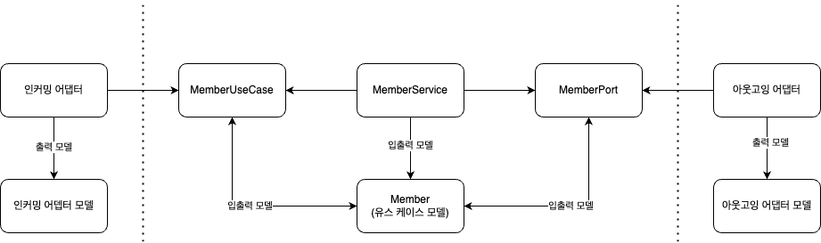
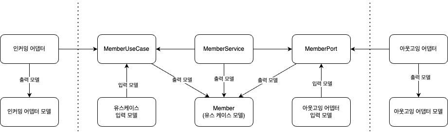

### 1. 클린 아키텍처에서 매핑이 필요한 이유
---

- 클린 아키텍처에서 매핑을 하는 가장 큰 이유는 계층간의 결합도를 낮추기 위해서이다.
- 영속성 관련 객체를 모든 비지니스 코드에서 작성하거나 외부로 응답하는 코드들을 비지니스 코드에서 작성하게 되면 계층간의 결합도가 올라가기 시작하며, 수정하기 쉽지 않은 코드가 된다.
- 또한 하나의 객체에 여러 역할이 생기기 때문에 해당 객체를 봐도 어떤 역할을 할지 명확하게 파악하기 힘들 수 있다.
```java
//매핑을 하지 않아 결합도가 올라간 코드
public class Member {

  @JsonProperty("username1")
  @SerializedName("username2")
  @Column(name = "username3")
  private String username;
}
```
- 계층간의 결합도를 낮추고 역할을 명확히 하며 관심사를 분리하여 비지니스 코드에만 집중할 수 있도록 하기 위해서는 매핑을 하는 행위가 필수이다.

### 2. 용어 정리
---

- 클린아키텍처의 대표적인 패턴인 포트와 어댑터 패턴를 기준으로 계층명 및 역할을 간단히 정리하고자 한다. 
- 인커밍 어댑터
  - 외부로 부터 요청을 받아 무슨일을 할지 프로그램에게 알려주는 역할을 한다.
  - 대표적으로 Controller가 있다.
- 유스 케이스
  - 내부로 부터 모든 비지니스 로직을 담당한다.
  - 서비스 계층 및 도메인 계층에 해당한다.
- 아웃고잉 어댑터
  - 주로 저장소와 통신할 책임을 가진 어댑터이다.
  - 저장소란 I/O를 이용해 데이터를 가져올 수 있거나 변경할 수 있는 모든 것을 의미한다. 
    - 데이터베이스, API, 파일 등등…

### 3. 매핑 전략
---

#### 3.1. 양방향 매핑 전략

- 각 계층이 전용 모델을 가진 매핑 전략을 양방향 매핑 전략이라고 한다.

- 각 계층이 전용 모델을 가지있으며 계층을 이동하며 매핑할 책임을 가지고 있다.
- 각 모델별 역할
  - 인커밍 어댑터 관련 모델은 외부에 데이터를 최적으로 표현할 수 있는 구조를 가진다.
  - 아웃고잉 어댑터 관련 모델은 저장소를 최적으로 표현할 수 있는 구조를 가진다.
  - 유스케이스 관련 모델은 외부 인프라 관련 코드를 가지지 않으며 오로지 서비스 내부에서만 사용되며 해당 비지니스 로직을 가장 잘 표현한 구조를 가진다.
- 양방향 매핑 전략의 장점
  - 모델에 대한 책임이 명확하며 단일 책임 원칙을 위반하지 않는다.
  - 인커밍 어댑터 모델 및 아웃고잉 어댑터 관련 모델의 변경이 유스 케이스 계층에 오염시키지 않는다.
- 양방향 매핑 전략의 단점
  - 매핑 라이브러리를 사용한다고 해도 두 모델간의 매핑을 구현하는데 상당한 시간이 걸릴 수 있다.
  - 유스 케이스 모델이 인커밍 어댑터, 아웃고잉 어댑터 입력 파라미터로 사용될 수 있기 때문에 외부 계층의 요구사항으로 쉽게 변경될 수 있다.
- 어느 상황에 사용해야 할까?
  - 외부 요청에 의해 데이터를 읽어야하는 상황에서 사용하는 것이 좋다.
    - ex) `@GetMapping`
  - 외부 요청에 의해 데이터를 읽어야하는 상황은 주로 입력 파라미터 검증이 없는 경우가 많고, 입력 파라미터의 양 자체가 적은 경우도 많기 때문이다.
  - 또한 외부 요청에 의해 데이터를 읽어야하는 상황에서 유스케이스 모델을 이용해 입력파라미터로 사용하는 경우가 잘 없다.
  - 하지만 외부 요청에 의한 내용의 입력 파라미터가 많은 경우에는 다른 매핑 전략을 고려하는 것도 생각해봐야한다.
    - 왜냐하면 유스케이스 내부에서 입력 파라미터 검증 코드가 여러가지 들어갈 수 있기 때문이다.

#### 3.2. 완전 매핑 전략
- 각 계층이 입출력 전용 모델을 가진 매핑 전략을 완전 매핑 전략이라고 한다.

- 인커밍 어댑터에서 유스 케이스로 넘어올 때 유스케이스에 최적화된 입력 모델을 사용하고, 유스케이스에서 아웃고잉 어댑터로 넘어 갈때도 아웃고잉 어댑터에 최적화된 입력 모델을 사용한다.
- 양방향 매핑 전략 사용시 어떤 일이 발생할까?
  - 각 계층들은 전용 필드와 유효성 검증 로직을 가진 입력 모델을 가진다.
  - 유스케이스와 어댑터들은 입력된 결과에 대한 로직 검사와 해당 계층에 입력을 넘기기위한 모델을 만드는 역할을 수행한다.
- 양방향 매핑 전략의 장점
  - 다양하고 복잡한 유스케이스가 발생하는 구조에서 각 계층을 지날때 마다 필요한 입출력의 모델 역할이 명확하여 코드를 작성하는 사용자 입장에서 편리해진다.
  - 검증 로직에 대한 책임 분리가 명확해진다.
  - 인커밍 어댑터 모델 및 아웃고잉 어댑터 관련 모델의 변경이 유스 케이스 계층에 오염시키지 않는다.
  - 외부 계층의 요구사항으로 인한 영향을 덜 받는다.
- 양방향 매핑 전략의 단점
  - 양방향 매핑 전략보다 더 많은 모델을 매핑해야하기 때문에 많은 시간이 걸릴 수 있다.
- 어느 상황에 사용해야 할까?
  - 외부 요청으로 인해서 데이터를 쓰는 작업에 유리하다.
  - 데이터를 작성해야하는 입력에 대한 검증, 저장소에 데이터에 대한 검증, 데이터 입력 세가지 역할이 있다.
    - 완전 매핑 전략의 경우에는 입력에 대한 검증, 저장소에서 데이터를 가져와 검증, 입력에 대한 명확한 역할 분리가 가능하기 때문에 유리하다.


